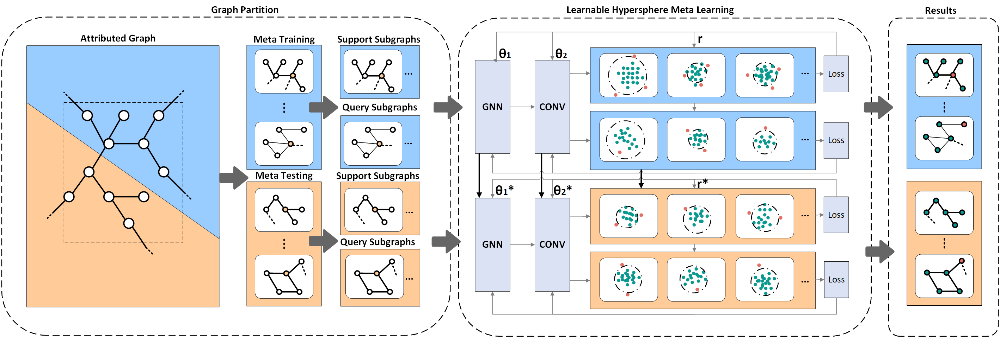

# LHML

Learning Hypersphere for Few-shot Anomaly Detection on Attributed Networks

The existence of anomalies is quite common, but they are hidden within the complex structure and high-dimensional node attributes of the attributed networks. As a latent hazard in existing systems, anomalies can be transformed into important instruction information once we detect them, e.g., computer network admins can react to the leakage of sensitive data if network traffic anomalies are identified.  Extensive research in anomaly detection on attributed networks has proposed various techniques, which do improve the quality of data in networks, while they rarely cope with the few-shot anomaly detection problem. Few-shot anomaly detection task with only a few dozen labeled anomalies is more practical since anomalies are rare in number for real-world systems.

We propose a few-shot anomaly detection approach for detecting the anomaly nodes that significantly deviate from the vast majority. Our approach, based on an extension of model-agnostic meta-learning(MAML), is a **L**earnable **H**ypersphere **M**eta-**L**earning method running on local subgraphs named LHML. LHML learns on a single subgraph, conducts meta-learning on a set of subgraphs, and maintains the radius of a learnable hypersphere across subgraphs to detect anomalies efficiently. The learnable hypersphere is a changing boundary that can be used to identify anomalies in an unbalanced binary-classification setting and quickly adapt to a new subgraph by a few gradient updating steps of MAML. Furthermore, our model runs across subgraphs, making it possible to identify an anomaly without requiring the whole graph nodes as is usually the way but only a handful of nodes around it, which means LHML can scale to large networks. Experimental results show the effective performance of LHML on various datasets.



## Requirements

```
dgl-cu110==0.6.1
metis==0.2a5
networkx==2.6.3
numpy==1.21.2
scikit-learn==1.0.1
scipy==1.7.1
torch==1.7.1
```

## Evaluation

```
# modify "--root"
python train.py
```

## Preprocessing

We follow the anomaly injection method used in some previous works to process the original clean datasets, as described in our paper.

Refer to https://github.com/GRAND-Lab/CoLA/blob/main/inject_anomaly.py for processing your own datasets.

Refer to graph_partition.py for graph partition.

## Others

We follow and reuse some works as described in our paper and code.

When training a new dataset, adjusting the initial value of the reference radius(ref_radius) is helpful for model training.

## Cite us

```
@inproceedings{lhml,
  author    = {Qiuyu Guo et al.},
  title     = {Learning hypersphere for few-shot anomaly detection on attributed networks},
  booktitle = {{CIKM} '22: The 31th {ACM} International Conference on Information
               and Knowledge Management, Atlanta, GA, USA, October
               17 - 21, 2022},
  publisher = {{ACM}},
  year      = {2022}
}
```

## Contact

Send an email to qiuyuguo@e.gzhu.edu.cn if you have any question.
